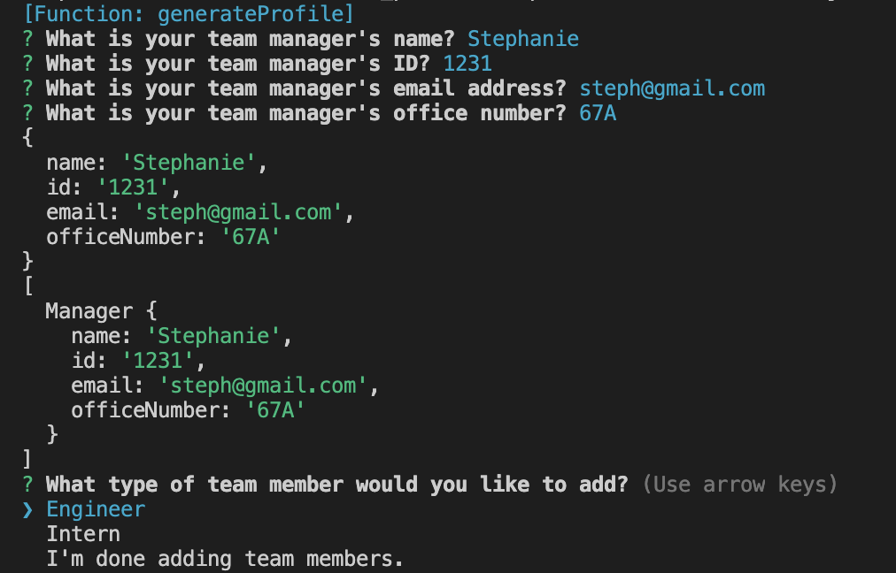
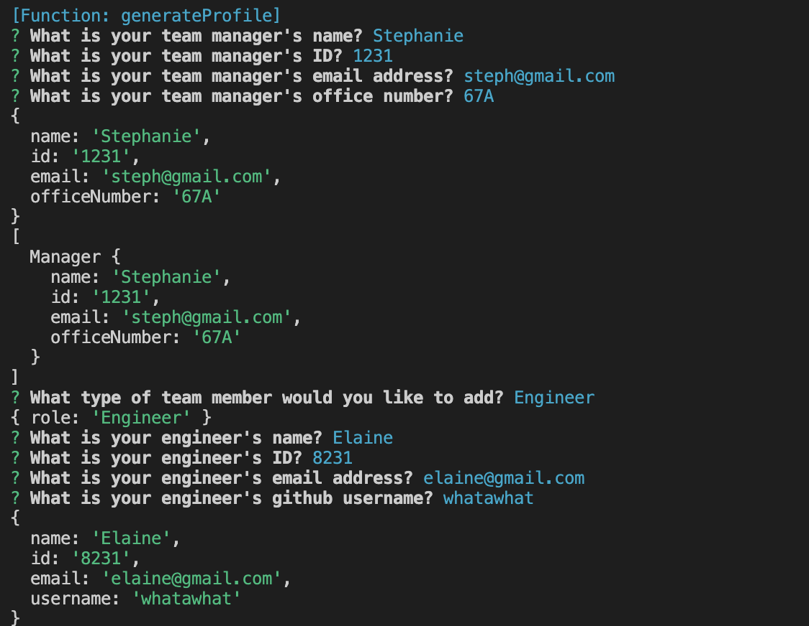

# Team Profile Generator
### Table of Contents
- [Description](#Description)
- [Video Link](#video-link)
- [Tests](#tests)
- [How to Use](#how-to-use)
- [Screenshots](#screenshots)
- [Sources](#sources)

## Description
This is an application that allows the user to input data for their team via the terminal and then an HTML file is generated.

## Video Link
[Link to Video Walkthrough](https://drive.google.com/file/d/1Y1387oLMv15UVaobafnYd0-dpTm5bjFo/view)

## Tests
I used Jest NPM package to test the code. There were 4 tests and all tests passed. If you want to run the tests, use the following code:
```bash
npm run test
```

## How to Use
Install the necessary NPM packages to run the program. You will need inquirer and jest. 
```bash
npm install inquirer
npm install jest
```

After you install the NPM packages, open the terminal and run 
```bash
node index.js
```

Input all data for your team. Once you are done, select that you are done. From there, an HTML file will be generated.

## Screenshots
This is the screen after you input the manager and given the option to add another team member.


This is the screen after two team members are added.



This is the HTML file that is generated after all team members are added.


## Sources
Created and designed by me. Click [whatawhat](www.github.com/whatawhat) to visit my repository.

